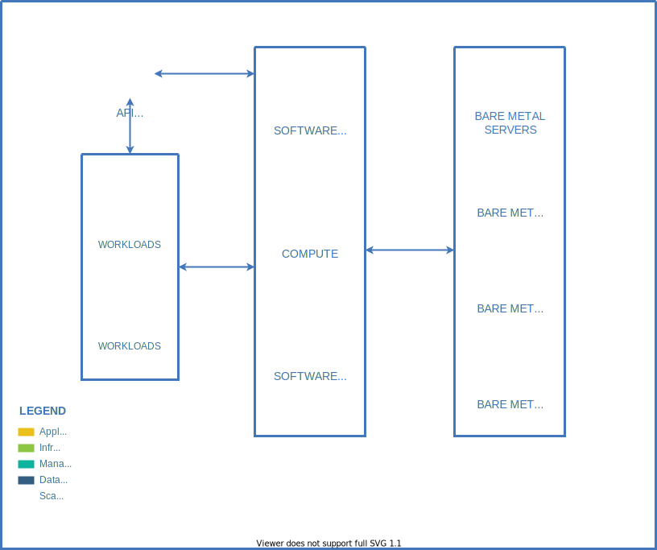

# Apalabrados

**Apalabrados** is a nice database to save the user input and store it according to the data type.
* Numbers: It saves your input and accumulates with the last accumulated.
* Text: It saves your input and its first and last character.
* Special characters: It saves it from your input, only the special characters.

**Apalabrados** is part of challenge of diagnostic in Platzi Master Cohort[8].

## How to use it

**Step 1:** go to [Home](https://apalabrados-isabely.herokuapp.com/) and insert and input you want.


**Step 2:** When you have submitted an input **Apalabrados** redirect to app [response](https://apalabrados-isabely.herokuapp.com/submit).
There you can see the result of database that is saved and proceced yhe input according to the data type. 


You could go to back to the home and try the times you want!

## How to I made it

To develop this app I followed this steps in its order.

1. Make a github [repository](https://github.com/isabelyb/apalabrados).
2. Make a first version of the process with data flowchart. Then I have to adjust some details i nthe develop app process. I use [drawio](https://app.diagrams.net/) to do it.
    
3. How I feel more comfortable with Python, I looked for a better way to do a Web App using it. I found the more efficient tool was Flask, so I learned from zero how to do it.
I read a lot of sources, these were the most helpful for me:
    * [Platzi](https://platzi.com/clases/flask/)
    * [Documentation](https://palletsprojects.com/p/flask/)
    * [Pythonise tutorial](https://pythonise.com/series/learning-flask/flask-application-structure)
    * [python-adv-web-apps](https://python-adv-web-apps.readthedocs.io/en/latest/flask.html)
4. Make a first version of the App structure. As the _proces data flowchart_ I have to adjust some details in the develop app process. Too, I use [drawio](https://app.diagrams.net/) to do it.
    
5. Looking and learn about how to connect MongoDB with a Flask App. Some time ago I have learned about some basics from mongo in [Platzi](https://platzi.com/clases/mongodb/).
    [Mongodb](https://docs.mongodb.com/)
    [Pythonbasics tutorial](https://pythonbasics.org/flask-mongodb/)
6. Code!
    6.1. Create an environment 

    ```virtualenv venv```
    Activate environment
    ```source venv/bin/activate```

    6.2. Install Flask
    ```pip3 install Flask```
    
    6.3 Create file start.py to start app

    6.4. Establecer variable de entorno de la línea de comando
    ```export FLASK_APP=main.py```

    6.5. Strart debugger = on
    ```export FLASK_DEBUG=1```

    6.5. Run Flask
        ```flask run```

        generating requirements

    ```pip3 freeze > requirements.txt```


    6.7 Create App

    6.7 Create Templates

     Create database in mongodb

    6.8 Install mongo create data base and conect with app
    pip3 install Flask-PyMongo


make to input is saved in mongodb (without classifier)

create clasifier function

get data from mongo db

accumulated numbers

post acumulated in accumulated column !!

post all data in the collection of bd in mongo

get table in html from mongo db

modules

format html


# Deploy

Made in [Herohu](https://apalabrados-isabely.herokuapp.com/)
Cli
Version Python

procfile

runtime

I was so happy for this. This is my first App complet from zero to deploy.

```pip3 install -r requirements.txt```

##  Instructions to Download


